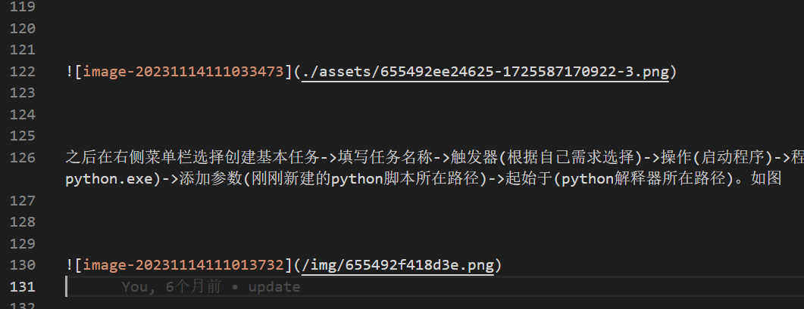
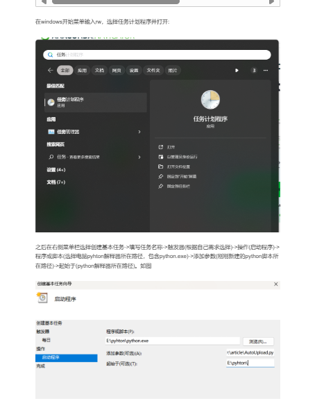

# 前言
本项目forked自[https://github.com/qiubaiying/qiubaiying.github.io](https://github.com/qiubaiying/qiubaiying.github.io)，关于如何初始化项目此处不再赘述，请参考原项目README。这里主要说说针对原项目的修改

# 修改

## 一、添加博客时不用再手动为博客打上日期标签


在 **Jekyll 博客** 中，要求 **文章文件名必须包含日期**，博客文章（post）默认放在 `_posts` 目录下。
每篇文章都必须遵守文件命名规则：

```
YYYY-MM-DD-title.md
```

比如：

```
2025-10-10-my-first-post.md
```

这将导致如果从其他源导入文章时，需要手动为导入的文章添加日期标签。如果文章数量过多，那么这个过程就会非常麻烦。
为了解决这个问题，此处通过GitHub工作流来实现在自动为`_post`目录下的markdown文件添加日期标签。具体逻辑为：
1. 创建一个工作流任务，此工作流的作用为将`_post`目录下的文件批量重命名.内容如下:
	```yml

	      - name: Add default date to posts
        run: |
          for file in _posts/*.md; do
            if ! grep -q "^date:" "$file"; then
              # 在 Front Matter 添加默认 date
              sed -i "0,/^---$/s/^---$/---\ndate: 2025-01-01/" "$file"
            fi
            # 如果文件名没有日期，给它加上
            if [[ ! $(basename "$file") =~ ^[0-9]{4}-[0-9]{2}-[0-9]{2}- ]]; then
              mv "$file" "$(dirname "$file")/2025-01-01-$(basename "$file")"
            fi
          done
	```

这样在添加博客时，只需要在`_post`目录下添加markdown文件，将文件提交到远程仓库触发trigger时即可自动添加日期标签。

## 二、博客引用图片地址兼容./ 写法


本人在 Typora 中写 Markdown 时使用：

```markdown

```

文件结构是这样的：

```
_posts/
  2025-03-27-my-post.md
  assets/
    xxx.png
```

这种方式：

* 在 Typora 本地预览 ✅ 没问题；
* 在纯 Markdown 阅读器中 ✅ 也是标准兼容的；
* Markdown 本身没错。

---


但是当运行 Jekyll 或 GitHub Actions 构建时，
Jekyll 会把每篇文章渲染成 HTML，放在 `_site` 目录下，比如：

```
_site/
  2025/03/27/my-post/index.html
```

但是图片并不会自动被移动，它依然是：

```
_site/
  assets/xxx.png
```

这就造成了路径错位：

* Markdown 中写的是：

  ```
  assets/xxx.png
  ```
* 页面构建后访问路径变成：

  ```
  https://jdfcc.github.io/2025/03/27/my-post/assets/xxx.png  ❌
  ```
* 实际图片位置是：

  ```
  https://jdfcc.github.io/assets/xxx.png  ✅
  ```

👉 所以浏览器访问不到图片。

此处通过把错误的相对图片路径改成网站根路径，即将`post.html`中的
`{content}`替换为
`{{ content | replace: 'src="assets/', 'src="/assets/' | replace: 'src="./assets/', 'src="/assets/' }}`
从而让图片无论在哪个文章子目录下都能正确加载。原理如下:

### 1️⃣ Markdown 原文：

```markdown

```

### 2️⃣ Jekyll 解析 Markdown → HTML

Jekyll（或 kramdown）会把它变成：

```html
<p></p>
```

注意⚠️：
这里的 `src="assets/img.png"` 是**相对于页面路径**的。
但实际生成的网页路径其实是这样的：

```
/2025/03/27/my-post/index.html
```

所以浏览器会尝试加载：

```
/2025/03/27/my-post/assets/img.png   ❌ 不存在
```

---

### 3️⃣ 模板层（`_layouts/post.html`）

在模板里，HTML 是通过：

```liquid
{{ content }}
```

插入页面的。

此时我们加上过滤器：

```liquid
{{ content | replace: 'src="assets/', 'src="/assets/' }}
```

会让 Jekyll 在生成最终 HTML 时执行一个文本替换操作：

把：

```html

```

改成：

```html

```

---

### 4️⃣ 浏览器渲染结果

最终网页是：

```
https://jdfcc.github.io/2025/03/27/my-post/
```

但图片路径 `/assets/img.png` 会被浏览器解释为：

```
https://jdfcc.github.io/assets/img.png ✅
```

所以图片终于能显示了 🎉

---

## 🧩 本质上的“修复机制”

| 阶段          | 内容                            | 状态            |
| ----------- | ----------------------------- | ------------- |
| Markdown 阶段 | ``      | ✅ Markdown 正常 |
| HTML 渲染后    | ``  | ❌ 路径错误（相对页面）  |
| 模板过滤器替换     | `` | ✅ 修正为网站根路径    |

✅ 它的作用就像一个“构建时路径纠正器”，
在最后一刻，把错误的相对路径改成浏览器能找到的绝对路径。

---

---

## 🧠 延伸理解

这其实是模板层（Liquid）做的“后处理（post-processing）”技巧。
原理非常简单：在 HTML 输出前，对内容字符串执行替换。
类似于：

```bash
sed 's/src="assets\//src="\/assets\//g'
```

但我们把它内嵌到了模板系统中，Jekyll 每次构建都会自动完成。效果如下:





