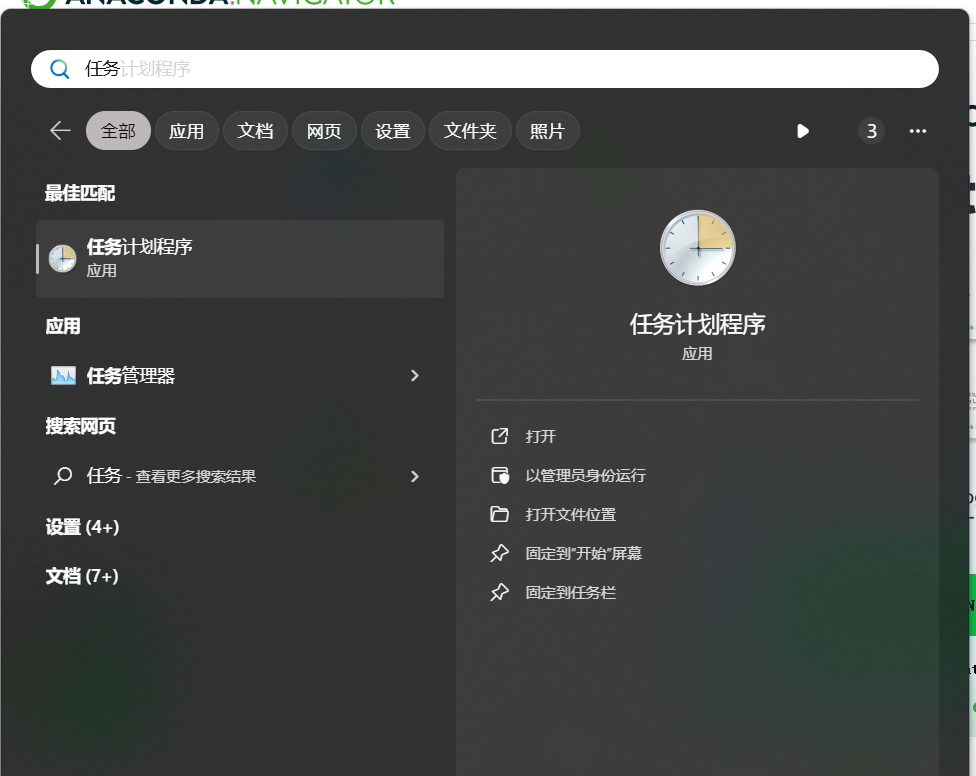
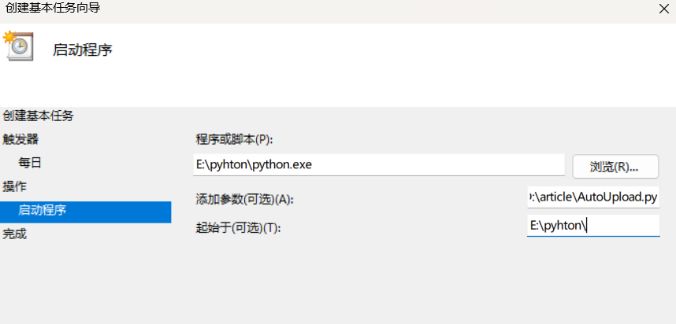

电脑上有pyhon环境，已经有自己的git账户以及一个git仓库，并且以及将本地markdown文档向仓库执行过至少一次提交，这里不在过多赘述。

## 开始

首先创建python脚本如下:

```python
import subprocess
import time
import logging
import os
import sys
 
#os.chdir(r'D:article')
os.chdir(r'你的本地typora仓库地址')
 
print("Running")
# 设置日志文件路径 可选
#log_dir = os.path.join(os.getcwd(), 'log')
#os.makedirs(log_dir, exist_ok=True)
#log_file_path = os.path.join(log_dir, 'git_script.log')
 
# 配置日志记录 可选
#logging.basicConfig(filename=log_file_path, level=logging.INFO, format='%(asctime)s - %(levelname)s: %(message)s')
 
logging.info("Running")
 
def execute_command(command):
    process = subprocess.Popen(command, shell=True, stdout=subprocess.PIPE, stderr=subprocess.PIPE)
    stdout, stderr = process.communicate()
    return process.returncode, stdout.decode('utf-8'), stderr.decode('utf-8')
 
# 检查是否有修改的文件需要提交
return_code, _, error = execute_command('git diff --exit-code')
 
if return_code == 0 :
    logging.info("No changes to commit.")
    print("No changes to commit")
else:
    # 执行 git add .
    return_code, _, error = execute_command('git add .')
    print(return_code)
    if return_code == 0:
        logging.info("Git add successful.")
        print("Git add successful.")
        # 检查是否有新文件需要提交
        return_code, _, error = execute_command('git status --porcelain')
 
        if return_code == 0 :
            # 执行 git commit -m 'auto commit'
            return_code, _, error = execute_command('git commit -m "auto commit"')
 
            if return_code == 0:
                logging.info("Git commit successful.")
                print("git commit successful")
                # 执行 git push，带有最多3次的重试机制
                max_retries = 3
                for attempt in range(1, max_retries + 1):
                    return_code, _, error = execute_command('git push')
 
                    if return_code == 0:
                        logging.info("Git push successful.")
                        print("git push successful")
                        break
                    else:
                        logging.error(f"Error pushing to remote repository (Attempt {attempt}/{max_retries}): {error}")
                        print("error pushing to remote repository  ")
                        time.sleep(2)  # 等待2秒后重试
                else:
                    logging.error("Maximum retries reached. Git push unsuccessful.")
                    print("max retries reached. Git push unsuccessful.")
            else:
                logging.error(f"Error committing changes: {error}")
                print("Error committing changes")
        else:
            logging.info("No changes to commit.")
            print("no changes to commit")
 
        # 检查是否需要进行 git push
        return_code, _, error = execute_command('git status')
 
        if return_code == 0 :
            # 执行 git push，带有最多3次的重试机制
            max_retries = 3
            for attempt in range(1, max_retries + 1):
                return_code, _, error = execute_command('git push')
 
                if return_code == 0:
                    logging.info("Git push successful.")
                    print("Git push successful")
                    break
                else:
                    logging.info(f"Error pushing to remote repository (Attempt {attempt}/{max_retries}): {error}")
                    print("Error pushing to remote repository")
                    time.sleep(2)  # 等待2秒后重试
            else:
                logging.info("Maximum retries reached. Git push unsuccessful.")
                print("Maximum retries reached. Git push unsuccessful.")
                sys.exit(1)  # 1 表示脚本执行失败
    else:
        logging.info("No changes to commit.")
        print("No changes to commit.")
print("stopping")
```

在windows开始菜单输入rw，选择任务计划程序并打开:





之后在右侧菜单栏选择创建基本任务->填写任务名称->触发器(根据自己需求选择)->操作(启动程序)->程序或脚本(选择电脑pyhton解释器所在路径，包含python.exe)->添加参数(刚刚新建的python脚本所在路径)->起始于(python解释器所在路径)。如图





## 解决编辑属性时提示`一个或多个一个或多个指定的参数无效`的报错

打开常规->更改用户或组->高级(左下角)->立即查找->找到本机管理员名称后选择点击确定,勾选使用最高权限运行，确保脚本能够运行成功